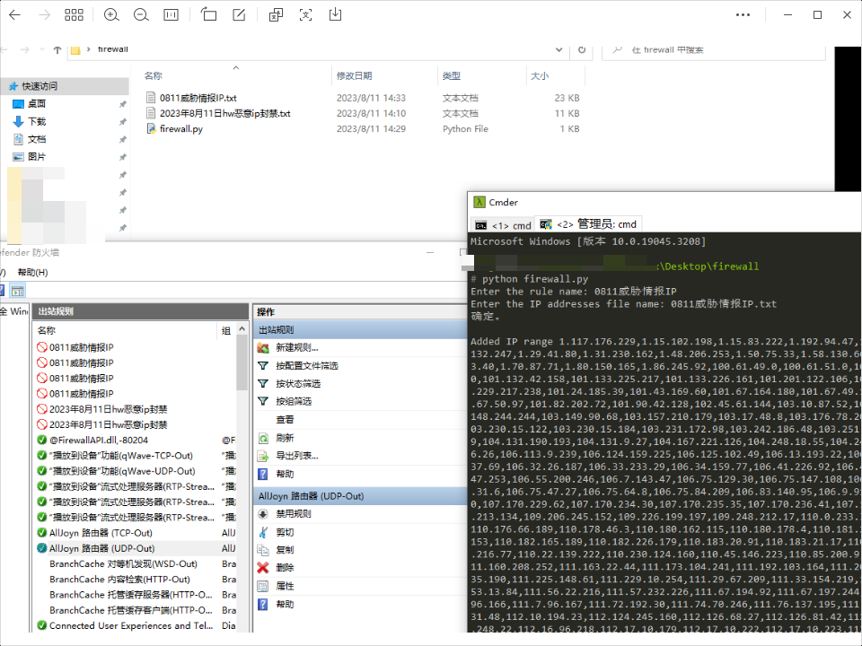

# windows防火墙批量添加恶意ip


## 介绍

批量将恶意ip添加到windows防火墙中，阻止机器访问恶意ip




# 使用说明

因为添加防火墙规则需要管理员权限，所以需要以管理员权限运行

```bash
python3 add_firewall.py
```
1. 输入规则名称

2. 输入恶意ip列表文件路径


# 备注

使用火绒也可以，参考 https://bbs.huorong.cn/forum.php?mod=viewthread&tid=130248&page=1#pid834332
